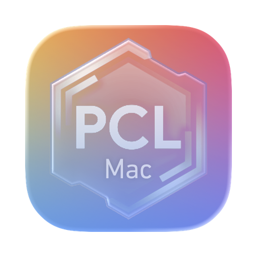

  
  <h1>PCL.Mac XE</h1>
  

 

PCL.Mac XE 是一个适用于 macOS 的非官方 Minecraft 启动器，基于 [PCL.Mac.Refactor](https://github.com/CylorineStudio/PCL.Mac.Refactor) 二次开发，使用 SwiftUI 框架构建。

## 原作者

- **[龙腾猫跃 (LTCatt)](https://afdian.com/a/LTCat)**：[Plain Craft Launcher (PCL)](https://github.com/Meloong-Git/PCL) 原作者
- **[风花 (AnemoFlower)](https://github.com/AnemoFlower)** / [Cylorine Studio](https://github.com/CylorineStudio)：[PCL.Mac.Refactor](https://github.com/CylorineStudio/PCL.Mac.Refactor) 原作者，本仓库的大部分代码源自该项目

## 本分支的新增功能

- **一键更新模组**：实例设置中可一键检查并批量更新 Modrinth 上的兼容版本，完成后展示每个 Mod 的版本变化明细
- **披风与皮肤选择**：主页侧边栏支持更换披风与上传皮肤（正版 / 第三方验证账号）
- **回声洞**：数据源与投稿接入 [xrst.uk](https://xrst.uk/hsd)，登录即可投稿
- **应用内自动更新**：更新检查与下载走 xrst.uk 升级接口，国内自动走镜像

## 下载

在 [Releases](https://github.com/AaronXieA/PCL.Mac-XE/releases) 中下载 PCL.Mac XE（Apple Silicon，DMG 格式）。

## 环境要求

|          |          最低           |    推荐     |
|:--------:|:-----------------------:|:-----------:|
| 普通使用 |       macOS 12.0        | macOS 14.0+ |
|   开发   | macOS 14.5 (Xcode 16)   |      —      |

## 许可证

- 沿用 [PCL](https://github.com/Meloong-Git/PCL) 与 PCL.Mac.Refactor 的许可证，并遵守其中关于"重度使用"的规定。
- PCL.Mac.Core（`PCL.Mac.Core/`）采用 MIT License 协议，使用其代码时请**保留许可证**及署名信息。
